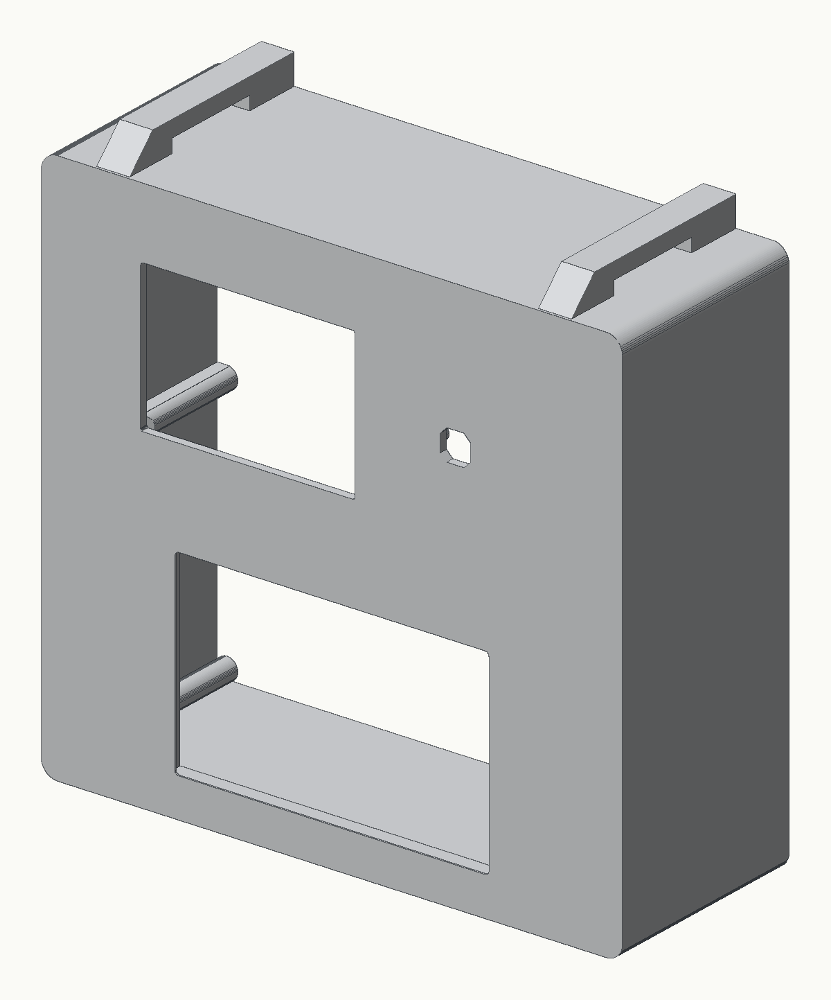

# Receipt Photobooth

A Raspberry Pi 5 photobooth that prints on a thermal receipt printer. Guests tap the touchscreen, take
three photos, and walk away with a receipt-tape keepsake.

This repo has everything to build one:

| Folder | What's in it |
|---|---|
| [`hardware/`](hardware/) | STL and 3MF files for the plain enclosure, the parts list, and how it goes together |
| [`software/`](software/) | the booth app (Python), the Pi setup, and a simulator that runs it on a laptop |
| [`docs/`](docs/) | the **Tape Bench**, a browser designer for the receipt (also live at the link below) |
| `sets/` | example receipt designs saved from the Tape Bench |

## Design a receipt in the browser

**https://darknet-doll.github.io/receipt_photobooth/**

A dot-for-dot simulator of the printer: 384 dots a line, 8 dots a millimetre, 48 mm of ink on 57 mm paper.
Change the shop name, the lines under each photo, the rules, the totals and the type sizes; the preview
redraws as you type. When you like it, press **Download receipt.json** and copy that file to
`~/photobooth/receipt.json` on your booth. The booth re-reads it at the start of every session, so there is
no restart.

The character palette on the left is every glyph the printer can actually print. A dashed box marked
**16** means that glyph goes faint at the small text size, so use it on a bigger line.

## Build one

1. **Parts:** see the parts list in [`hardware/README.md`](hardware/README.md). In short: a Raspberry Pi 5,
   a 5" HDMI touchscreen, a Camera Module 3, a 58 mm USB thermal printer and a USB-C power bank.
2. **Print:** the tub, the lid, the Pi bridge plate and two screen sleeves, from `hardware/stl/`.
3. **Assemble:** follow [`hardware/README.md`](hardware/README.md).
4. **Software:** follow [`software/README.md`](software/README.md). Flash Raspberry Pi OS, copy `software/`
   over, run one install script, and tap the Photobooth icon.

You don't need any hardware to try it: `software/tools/simulate.sh` runs the real booth UI in a window on
a Mac or PC, with a synthetic camera and the receipt saved as a PNG.

## Licence

- Code (`software/`, `docs/`): [MIT](LICENSE)
- Enclosure models (`hardware/`): [CC BY-NC 4.0](hardware/LICENSE). Build your own and remix it, but don't
  sell the enclosure.

Made by darknetdoll.
