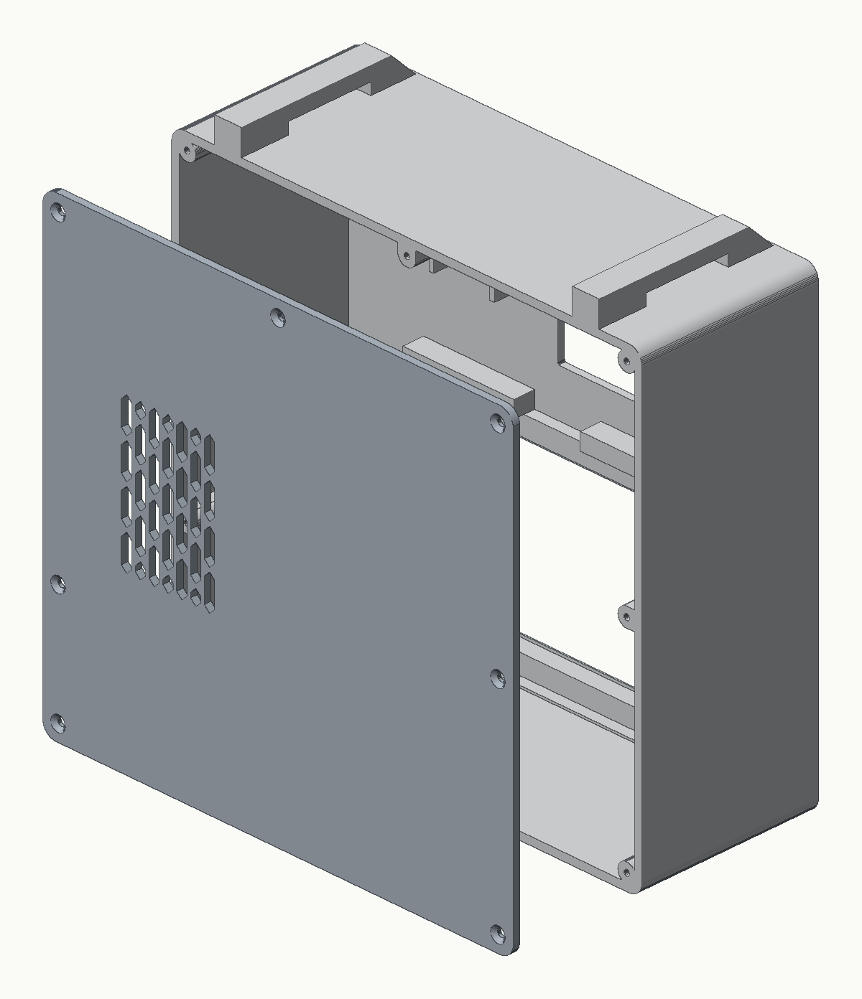
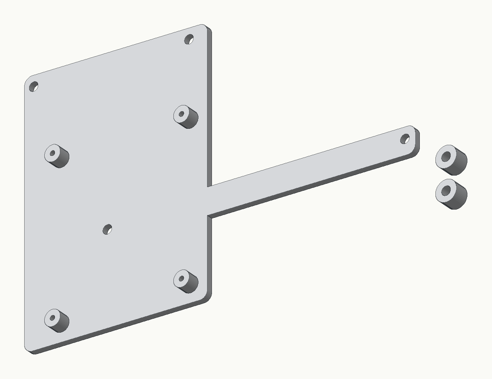

# Hardware

A two-part printed enclosure: a **tub** (the front face with the walls grown off its back) and a flat **lid**
that screws on the back. Inside, the screen bolts into the face, a **Pi bridge plate** bolts over the screen,
and the Pi rides on that plate. The power bank lies flat behind the screen.

| Front | Exploded, from the back |
|---|---|
|  |  |

Outside size: 211.8 × 210.5 × 82.5 mm (width × height including the two strap loops on top × depth with the lid).

## Parts list

| Part | Notes |
|---|---|
| Raspberry Pi 5, 4 GB | with the active cooler, a microSD card and a micro-HDMI to HDMI cable |
| ELECROW 5" HDMI touchscreen, 800 × 480 (model RC050S) | HDMI for video and micro-USB for touch + power. It is not a DSI screen. The face is sized for this exact board. |
| Camera Module 3 (Arducam's version) | with a 15-to-22-pin CSI cable for the Pi 5. The face's camera posts are measured from the Arducam board; the official Raspberry Pi board has its holes in slightly different places. |
| Tiny thermal receipt printer, CSN-A4L, USB | panel-mount, identifies itself as a **Gprinter GP-58**, ESC/POS, 384 dots per line. Its two wedge clips hold it in the face. |
| 57 mm thermal paper | rolls up to 30 mm across |
| USB-C power bank, about 155 × 54 × 50 mm max | built around a UGREEN Nexode 25000. It needs a USB-C PD port for the Pi and a USB-A port for the printer. |
| USB-A to 2-wire lead for the printer's power | the printer needs its own 5 V, at least 1.5 A while printing. **Do not power it from the Pi.** |
| Optional: SK6812 **RGBW** LED strip | see [LED strip](#optional-led-strip) |

### Screws

| Joint | Screw | Qty |
|---|---|---|
| Screen, lower ears, into the face | M3 × 8 | 2 |
| Screen, upper ears, through the bridge bar and a sleeve | M3 × 16 | 2 |
| Bridge plate into the two bosses on the face | M3 × 12 | 2 |
| Pi onto the bridge plate | M2.3 × 5 | 4 |
| Camera onto its posts | M2 × 5 or M2.3 × 5 | 4 |
| Lid onto the tub | M3 × 10 countersunk | 6 |

Every screw is self-tapping into a printed pilot hole. There are no heat-set inserts or nuts.

## Printing

| File (`stl/` or `3mf/`) | Orientation | Supports |
|---|---|---|
| `tub` | face down on the bed | none: the hanging bosses and the strap loops are chamfered at 45° |
| `lid` | outer face down | none |
| `pi_bridge_plate` | plate flat, bosses up; the two screen sleeves are included beside it | none |
| `screen_sleeves` | the same two Ø8 × 6 mm sleeves on their own, standing, if you need spares | none |
| `test_corner_coupon` | as exported | none |

**Print the test corner coupon first.** It is one corner of the tub and the lid, with the lid fit and the
screw pilots. It takes a fraction of the tub's print time and tells you whether your printer's tolerances
suit the parts before you commit to the big print. The prototype was printed in PETG.

The 3MF files are the same parts in print orientation. Bambu Studio and PrusaSlicer open them directly.

## Assembly

All of this happens from the back, with the tub lying face down.

1. **Printer.** Push it into the larger cutout from the front and clamp it from behind with its two wedge
   clips. The face is 3 mm thick; the clips take 0 to 3.9 mm.
2. **Camera.** Put it on the four posts behind the small octagonal window with M2 × 5 screws, cable edge pointing down.
3. **Screen.** Drop it into the pocket in the lower half, HDMI edge toward the printer. Screw its two lower
   ears down with M3 × 8.
4. **Bridge plate.** Stand a sleeve on each of the screen's upper ears. Lay the bridge plate over them so its
   bar runs across the top of the screen and its top end sits on the two bosses near the top wall. Put M3 × 16
   through the bar and the sleeves into the upper ears, and M3 × 12 through the plate's top holes into the bosses.
5. **Pi.** Stand it on end on the plate's four bosses, USB ports up, with M2.3 × 5. Its port edge faces the side
   wall that has no middle boss, which is the space left free for the plugs.
6. **Camera cable.** Run it down from the camera, under the plate, round the plate's edge and into **CAM0**.
7. **Cables.** Run micro-HDMI from the Pi to the screen's HDMI. Run USB from the Pi to the screen's
   touch + power micro-USB (not the power-only one). Run USB from the Pi to the printer's data port.
8. **Power.** Lay the bank flat behind the screen along the bottom wall. Its USB-C port powers the Pi, and its
   USB-A port powers the printer through the 2-wire lead.
9. **Lid.** Close it with six M3 × 10 countersunk screws. The vent slots go over the Pi's cooler.

The two loops on the top wall take a carry strap.

```text
power bank USB-C  -> Raspberry Pi 5 (which powers the screen, touch and camera)
power bank USB-A  -> printer power (2-wire lead)
Pi micro-HDMI     -> screen HDMI
Pi USB            -> screen touch micro-USB
Pi USB            -> printer data   (it shows up as /dev/usb/lp0)
camera            -> CSI cable -> CAM0
```

The Pi bridge plate on its own:



## Optional: LED strip

The software drives an SK6812 **RGBW** strip (4 bytes a pixel, colour order GRBW) on GPIO10, physical pin 19,
and shows idle, capture and printing light cues. Without a strip it does nothing.

```text
strip +5V  -> its own 5 V supply, never the Pi's 5 V pins
strip GND  -> that supply's minus AND a Pi GND pin (pin 20), run alongside the data wire
strip DIN  -> GPIO10 (pin 19) through a 330-470 ohm resistor, under 20 cm
```

**Tie the grounds together.** If the Pi's ground and the strip supply's ground aren't joined, the data
line floats. You get wrong colours, frozen frames and random flicker, and it looks like every other fault.
Check with a meter that Pi GND and the supply's minus are a dead short before debugging anything else.
The Pi drives 3.3 V logic into a 5 V part with little margin, so a 74AHCT125 level shifter on the data line
is the robust fix.

Set the strip's pixel count in `software/booth/led.py` (`count`).
